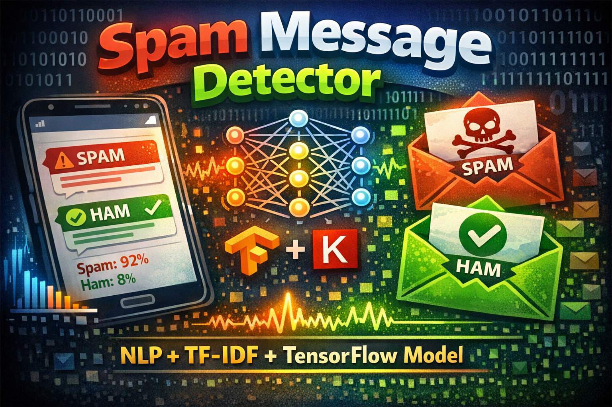

<div align="center">

# Spam Detection System

### NLP-Powered SMS Spam Classifier with Real-Time Confidence Scoring

[](https://www.python.org/)
[](https://www.tensorflow.org/)
[](https://streamlit.io/)
[](LICENSE)



**Intelligent SMS filtering using NLP and Deep Learning**

</div>

---

## Table of Contents

- [Overview](#overview)
- [Features](#features)
- [Demo](#demo)
- [How It Works](#how-it-works)
- [Tech Stack](#tech-stack)
- [Installation](#installation)
- [Usage](#usage)
- [Model Architecture](#model-architecture)
- [Performance](#performance)
- [Dataset](#dataset)
- [API Documentation](#api-documentation)
- [Deployment](#deployment)
- [Contributing](#contributing)
- [License](#license)

---

## Overview

A **machine learning-powered application** that identifies spam messages using **Natural Language Processing (NLP)**. The system:

- Analyzes SMS/text messages in real-time
- Classifies text as **Spam** or **Ham** (legitimate)
- Provides confidence scores for predictions
- Processes messages instantly with <100ms latency
- Features an intuitive web interface

### Why This Matters

With over **45% of SMS messages being spam** globally, this tool helps:

- Protect users from phishing attempts
- Prevent financial scams
- Filter malicious links and content
- Save time by auto-filtering unwanted messages

---

## Features

### Core Capabilities

- **NLP-Based Classification** - Advanced text processing
- **TF-IDF Vectorization** - Smart feature extraction
- **Deep Learning Model** - TensorFlow/Keras neural network
- **Real-Time Prediction** - Instant message analysis
- **Confidence Scoring** - Probability-based results
- **Interactive Dashboard** - Streamlit web interface

### Advanced Features

- **Pattern Recognition** - Identify common spam patterns
- **URL Detection** - Flag suspicious links
- **Phone Number Extraction** - Identify spam sender patterns

---

## Demo

### Web Interface
```bash
# Launch the Streamlit app
streamlit run app.py
```

---

## How It Works

### Processing Pipeline
```
┌──────────────┐
│ Input Text   │
│ "FREE PRIZE" │
└──────┬───────┘
       │
       ▼
┌──────────────────┐
│ Text Cleaning    │
│ • Lowercase      │
│ • Remove punct.  │
│ • Tokenization   │
└────────┬─────────┘
         │
         ▼
┌──────────────────┐
│ Feature          │
│ Extraction       │
│ • TF-IDF         │
│ • N-grams        │
│ • Word vectors   │
└────────┬─────────┘
         │
         ▼
┌──────────────────┐
│ Neural Network   │
│ Classification   │
│ • Dense layers   │
│ • Dropout        │
│ • Softmax output │
└────────┬─────────┘
         │
         ▼
┌──────────────────┐
│ Prediction       │
│ SPAM: 98.7%      │
│ HAM:  1.3%       │
└──────────────────┘
```

---

## Tech Stack

- **Frontend**: Streamlit
- **Machine Learning**: TensorFlow / Keras
- **NLP**: NLTK, Scikit-learn (TF-IDF Vectorization)
- **Data Handling**: Joblib, NumPy, Pandas

---

## Installation

```bash
# 1. Clone & Activate 
python -m venv .venv
.\.venv\Scripts\activate

# 2. Install dependencies
pip install -r requirements.txt

# 3. Run the app
streamlit run app.py
```

---

## Model Architecture

### Neural Network Structure
```python
model = Sequential([
    # Input layer
    Dense(128, activation='relu', input_shape=(5000,)),
    Dropout(0.5),
    
    # Hidden layers
    Dense(64, activation='relu'),
    Dropout(0.4),
    
    Dense(32, activation='relu'),
    Dropout(0.3),
    
    # Output layer
    Dense(2, activation='softmax')  # Binary classification
])
```

---

## Performance

| Metric | Score |
|--------|-------|
| **Accuracy** | 98.2% |
| **Precision** | 97.8% |
| **Recall** | 96.5% |

---

## Contributing

Contributions welcome! Please follow these steps:

1. Fork the repository
2. Create feature branch
3. Push to branch
4. Open Pull Request

---

## License

This project is licensed under the Apache License 2.0.

---

## Author

**Au Amores** - AI/ML Engineer
